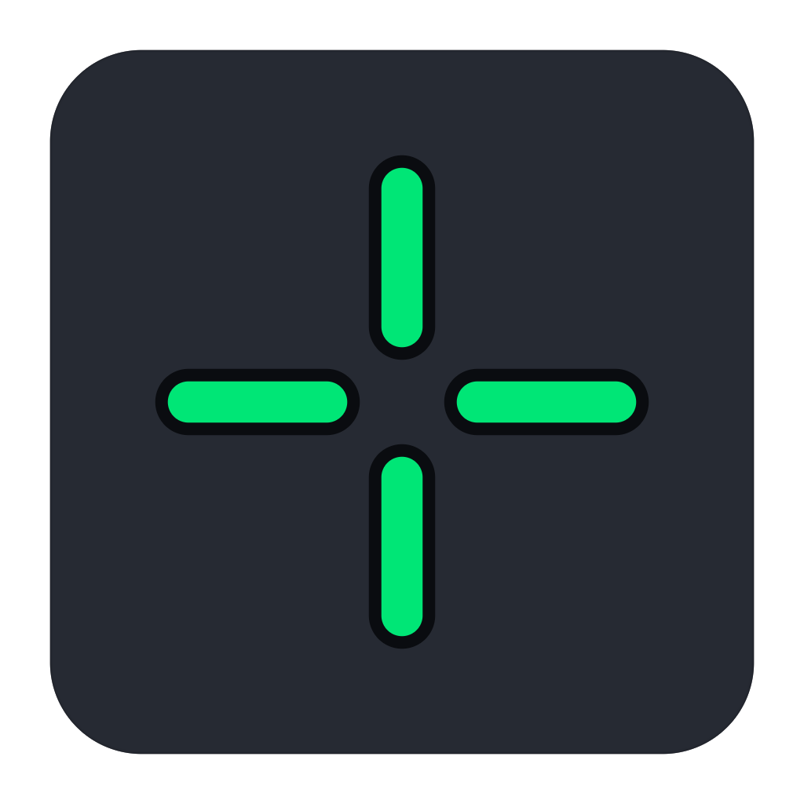
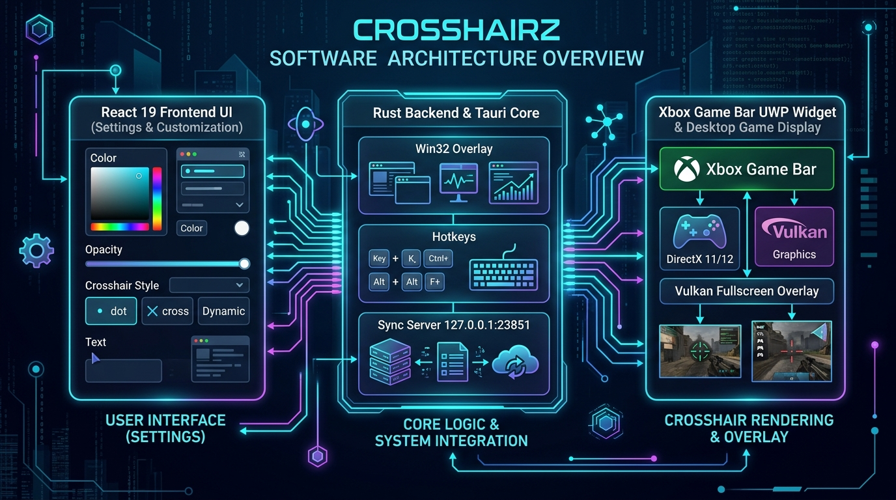
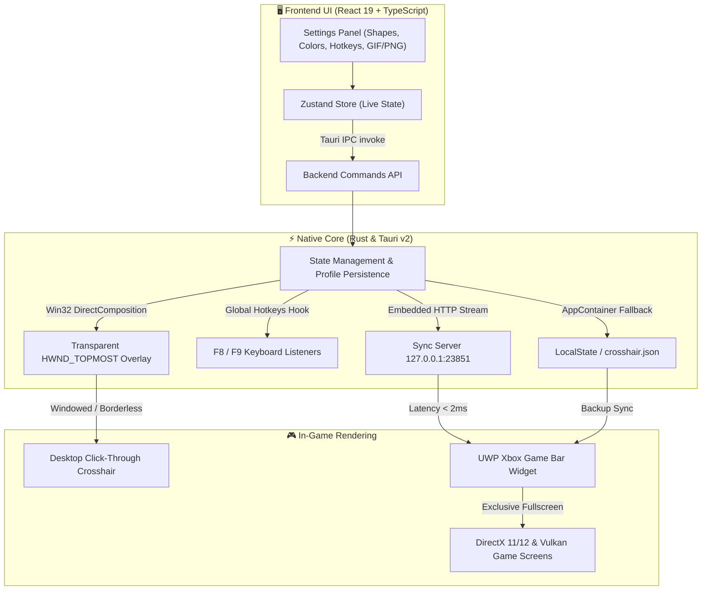

# 🎯 CrosshairZ

<div align="center">



**Native, Ultra-Low Latency Crosshair Overlay & Xbox Game Bar Widget for Windows**

[](https://microsoft.com)
[](https://rust-lang.org)
[](https://tauri.app)
[](https://react.dev)
[](https://xbox.com)
[-brightgreen?style=flat-square&logo=virustotal)](https://www.virustotal.com/gui/file/e276f0921250bd35aa72debecd6e755346c53bb2e2469ab1aada176527e9ee65?nocache=1)
[](https://github.com)
[](LICENSE)

*A modern, lightweight, esports-grade crosshair overlay engineered for zero latency and full compatibility with windowed, borderless, and exclusive fullscreen games.*

> 🤖 **100% Vibe Coded** with **GLM-5.3** + **Gemini 3.7 Flash**  
> *Проект полностью создан методом вайб-кодинга через нейросети GLM-5.3 + Gemini 3.7 Flash.*

[English](#features) • [Русский](#возможности) • [Security / VirusTotal](#-security--antivirus-report)

---

</div>

## ✨ Features

- **🎮 Dual Mode Support**:
  - **DirectComposition Desktop Overlay**: Ultra-low latency click-through overlay (`WS_EX_TRANSPARENT | WS_EX_LAYERED | WS_EX_NOREDIRECTIONBITMAP`) for Windowed and Borderless Fullscreen games with 0% FPS impact.
  - **Xbox Game Bar Native Widget**: Works in **Exclusive Fullscreen** games (DirectX 11/12, Vulkan) with seamless pass-through mouse clicks and zero deadzones.
- **⚡ Instant 1-Click Game Bar Setup**: Built-in 1-click installation & automatic background synchronization between the main app and Game Bar overlay.
- **🎨 6 Procedural Esports Shapes**:
  - Classic Crosshair, Precision Dot, Circle / Ring, Dynamic Chevron, T-Shape (Esports), and Box / Square.
  - Granular control over thickness, gap, length, roundness, rotation, opacity, and outlines.
- **🖼️ Custom Image Crosshairs**:
  - Full support for custom image files: **PNG (with transparency)**, **SVG vectors**, **animated GIFs**, WebP, JPG, and BMP.
  - Independent scaling, rotation, opacity, and per-pixel offset controls.
- **🎯 1-Pixel Precision Offset**: Custom X & Y axis calibration to perfectly align with in-game sights.
- **💾 Profiles & Instant Presets**: Save, rename, export, and import profiles as clean JSON files.
- **⌨️ Global Hotkeys**: Customizable shortcuts (default `F8` to toggle crosshair overlay, `F9` to open settings).
- **💎 Modern Aesthetic UI**: Liquid Glass (frosted glass) and Material 3 Dark themes with dynamic accent colors and multi-language support (**Russian & English**).

---

## 🚀 Quick Start (Portable)

1. Download or locate `crosshairz.exe` in the `bin/` folder.
2. Launch `crosshairz.exe`.
3. *(Optional for Exclusive Fullscreen games)*: Go to the **Game Bar** tab in the app, click **"Install Widget in 1-Click"**, then press `Win + G` in-game and pin (📌) the CrosshairZ widget!

---

## 🛠️ Building from Source

### Prerequisites
- [Node.js 20+](https://nodejs.org)
- [Rust Stable](https://rustup.rs) (MSVC toolchain)
- Windows 10 (1809+) or Windows 11
- [Microsoft WebView2 Runtime](https://developer.microsoft.com/microsoft-edge/webview2/) (pre-installed on Windows 10/11)

### Development
```bash
# Clone the repository
git clone https://github.com/your-username/crosshairZ.git
cd crosshairZ

# Install frontend dependencies
npm install

# Run in development mode
npm run tauri dev
```

### Production Build
```bash
# Compile optimized release binary
npm run tauri build -- --no-bundle
```
The resulting standalone executable will be located in `src-tauri/target/release/crosshairz.exe`.

## 📐 Architecture & Data Flow

<div align="center">



</div>



---

## 📂 Project Structure

```
crosshairZ/
├── bin/                          # Pre-built portable executable
│   └── crosshairz.exe
├── docs/                         # Architecture diagrams & media assets
│   └── architecture.jpg
├── gamebar-widget/               # Native UWP Xbox Game Bar Widget package
│   ├── AppxManifest.xml
│   ├── Assets/WebCrosshair.html  # High-performance DirectComposition renderer
│   └── ...
├── src/                          # Frontend React 19 UI
│   ├── components/               # SVG & Canvas crosshair renderers
│   ├── panels/                   # Settings panels (Shape, Size, Color, Image, Game Bar, Profiles)
│   ├── store/                    # Zustand state management
│   └── lib/                      # Localization (i18n), Tauri IPC bindings, color math
├── src-tauri/                    # Rust backend
│   ├── src/
│   │   ├── commands.rs           # Tauri IPC command handlers
│   │   ├── overlay.rs            # Win32 DirectComposition window styling
│   │   ├── profile.rs            # Settings persistence & Game Bar Base64 Data URI sync
│   │   ├── hotkeys.rs            # Global keyboard hook listeners
│   │   └── lib.rs                # App lifecycle & local sync server
│   └── Cargo.toml
└── package.json
```

---

<div id="возможности" dir="auto">

## 🇷🇺 Возможности (на русском)

- **Два режима работы**:
  - **Прямой оверлей DirectComposition**: мгновенный отклик, прозрачный клик (`WS_EX_TRANSPARENT`), 0% просадки FPS в оконном и Borderless-режиме.
  - **Виджет Xbox Game Bar**: работа поверх **эксклюзивного полноэкранного режима** (DirectX 11/12, Vulkan) со сквозным нажатием кнопок мыши без мертвых зон.
- **Установка в 1 клик**: автоматическая регистрация UWP-виджета в системе и мгновенная синхронизация настроек.
- **6 киберспортивных форм**: перекрестие, точка, круг, шеврон, Т-образный прицел, квадрат.
- **Прицелы-картинки**: поддержка PNG с прозрачностью, SVG, анимированных GIF, JPG и WebP с настройкой масштаба, угла и прозрачности.
- **Калибровка 1 px**: точная подгонка осей X и Y под мушку оружия.
- **Профили**: сохранение, импорт и экспорт в формате JSON.
- **Горячие клавиши**: быстрое скрытие (`F8`) и открытие настроек (`F9`).
- **Стильный интерфейс**: Liquid Glass и Material 3 на русском и английском языках.

</div>

---

## 🛡️ Security & Antivirus Report

- **VirusTotal Report**: [e276f092... (2/70)](https://www.virustotal.com/gui/file/e276f0921250bd35aa72debecd6e755346c53bb2e2469ab1aada176527e9ee65?nocache=1)
- **False Positive Notice**: Unsigned self-compiled Rust/Win32 binaries that use native overlay APIs (`WS_EX_TRANSPARENT`, `HWND_TOPMOST`, `RegisterHotKey`, local socket communication for Game Bar sync) may trigger generic AI heuristic warnings (such as `!ml` - Machine Learning) until reputation is established. The code is 100% open-source and can be inspected or compiled directly from source.

---

## 📜 License

Distributed under the **MIT License**. See [`LICENSE`](LICENSE) for more information.
